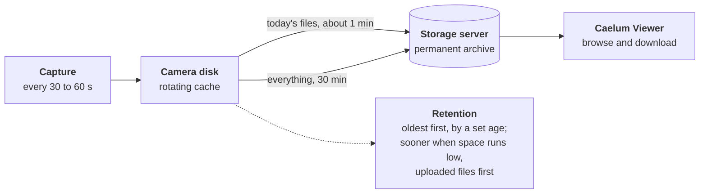

```mermaid
flowchart LR
  cap["<b>Capture</b><br/>every 30 to 60 s"] --> disk["<b>Camera disk</b><br/>rotating cache"]
  disk -- "today's files, about 1 min" --> srv[("<b>Storage server</b><br/>permanent archive")]
  disk -- "everything, 30 min" --> srv
  srv --> viewer["<b>Caelum Viewer</b><br/>browse and download"]
  disk -.-> ret["<b>Retention</b><br/>oldest first, by a set age;<br/>sooner when space runs low,<br/>uploaded files first"]

  class srv accent
  class ret dashed
```
