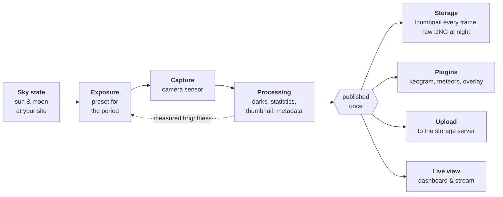

```mermaid
flowchart LR
  sky["<b>Sky state</b><br/>sun & moon<br/>at your site"] --> exp["<b>Exposure</b><br/>preset for<br/>the period"]
  exp --> cap["<b>Capture</b><br/>camera sensor"]
  cap --> proc["<b>Processing</b><br/>darks, statistics,<br/>thumbnail, metadata"]
  proc -. "measured brightness" .-> exp
  proc --> pub{{"published<br/>once"}}
  pub --> st["<b>Storage</b><br/>thumbnail every frame,<br/>raw DNG at night"]
  pub --> pl["<b>Plugins</b><br/>keogram, meteors, overlay"]
  pub --> up["<b>Upload</b><br/>to the storage server"]
  pub --> live["<b>Live view</b><br/>dashboard & stream"]

  class exp accent
  class pub bus
```
