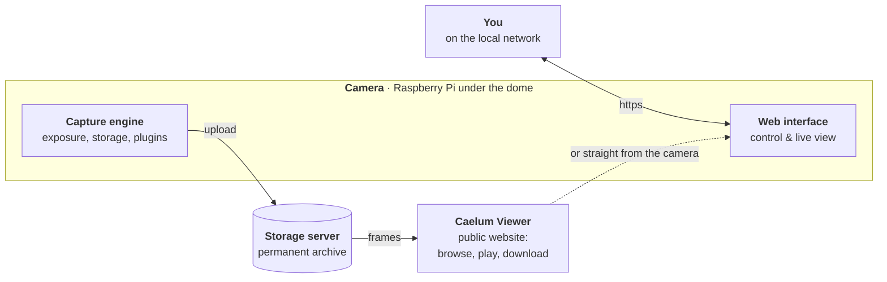

```mermaid
flowchart LR
  you["<b>You</b><br/>on the local network"]
  subgraph cam["<b>Camera</b> · Raspberry Pi under the dome"]
    ui["<b>Web interface</b><br/>control & live view"]
    eng["<b>Capture engine</b><br/>exposure, storage, plugins"]
  end
  srv[("<b>Storage server</b><br/>permanent archive")]
  viewer["<b>Caelum Viewer</b><br/>public website:<br/>browse, play, download"]

  you <-- https --> ui
  eng -- upload --> srv
  srv -- frames --> viewer
  viewer -. "or straight from the camera" .-> ui

  class eng,viewer accent
```
